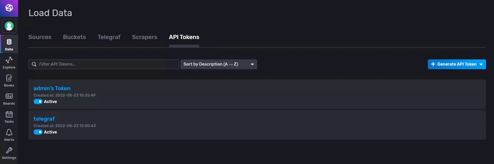

# Manual way

This section will explain how to deploy the platform manually. Basically, you will have to deploy or install the different components and then connect them. The procedure explained below is the one followed to deploy them in **Kubernetes** using in most cases the **Helm** option, but any other installation in which all the components are correctly installed and there is some kind of network between them to be able to communicate can be used. 

It is not necessary to deploy all components if not all functionalities are to be used. Check the [architecture](#architecture) section to find out which ones are essential and what functionality is covered by each of them.

## Requirements to deploy manually
- [Docker](https://www.docker.com/)
- [Kubernetes](https://kubernetes.io/)
- [Helm](https://helm.sh/)


## Steps to deploy
We recommend installing all components in the same Kubernetes namespace to make it easier to identify and control them all. In our case the namespace name will be stored in a bash variable called **NS**.

:::tip IMPORTANT

Also note that the values files have the variables that we recommend for the installation of each Helm Chart, but they can be extended or modified according to your needs (to do so, please consult the Helm Chart documentation).

:::

### Eclipse Ditto and Eclipse Hono
To deploy both Eclipse Ditto and Eclipse Hono we will directly install the [cloud2edge package](https://www.eclipse.org/packages/packages/cloud2edge/), which is specially created to allow these two tools to connect correctly.
Before executing the commands we will need to have the files [pv-hono.yaml](assets/pv-hono.yaml), [pv-mongodb.yaml](assets/pv-mongodb.yaml), [pvc-mongodb.yaml](assets/pvc-mongodb.yaml) and [values-cloud2edge.yaml](assets/values-cloud2edge.yaml) in the folder where we are in the terminal.
Once ready, and complying with all the [prerequisites](https://www.eclipse.org/packages/prereqs/) of the package, we execute the following commands.

```bash
helm repo add eclipse-iot https://eclipse.org/packages/charts
helm repo update

kubectl create namespace $NS
kubectl apply -f pv-hono.yaml -n $NS
kubectl apply -f pv-mongodb.yaml -n $NS
kubectl apply -f pvc-mongodb.yaml -n $NS

helm install -n $NS --wait --timeout 15m dt eclipse-iot/cloud2edge --version=0.2.3 -f values-cloud2edge.yaml --dependency-update --debug
```
If all pods are running and ready we already have the first two components installed.

### Apache Kafka
To deploy Kafka, the yaml files from another project have been reused, but it could also be installed [using Helm](https://github.com/bitnami/charts/tree/master/bitnami/kafka) if you prefer. 

For Kafka to work, it is necessary to install [ZooKeeper](https://zookeeper.apache.org/) beforehand. In addition, [CMAK](https://github.com/deltaprojects/kafka-manager-docker), a tool to manage Apache Kafka, will be used to make it easier to use. Then, for the deployment, the [pod-zookeeper.yaml](assets/pod-zookeeper.yaml), [svc-zookeeper.yaml](assets/svc-zookeeper.yaml), [pod-kafka.yaml](assets/pod-kafka.yaml), [svc-kafka.yaml](assets/svc-kafka.yaml), [deploy-kafka-manager.yaml](assets/deploy-kafka-manager.yaml) and [svc-kafka-manager.yaml](assets/svc-kafka-manager.yaml) files will be needed. Once you have them, you only need to apply them to the chosen namespace.

```bash
kubectl apply -f pod-zookeeper.yaml -n $NS
kubectl apply -f svc-zookeeper.yaml -n $NS

kubectl apply -f pod-kafka.yaml -n $NS
kubectl apply -f svc-kafka.yaml -n $NS

kubectl apply -f deploy-kafka-manager.yaml -n $NS
kubectl apply -f svc-kafka-manager.yaml -n $NS
```

### InfluxDB
For InfluxDB, [Helm](https://github.com/influxdata/helm-charts/tree/master/charts/influxdb2) will again be used for deployment. The following sc-influxdb2.yaml and pv-influxdb2.yaml files will be required to be applied before installation. In addition, the recommended values are in the values-influxdb2.yaml file (it is recommended that you check it before installing and change the *password* variable to your preference).

```bash
helm repo add influxdata https://helm.influxdata.com/

kubectl apply -f sc-influxdb2.yaml -n $NS
kubectl apply -f pv-influxdb2.yaml -n $NS

helm install -n $NS influxdb influxdata/influxdb2 -f values-influxdb2.yaml --version=2.0.10 
```

### Grafana
Deploying Grafana is very similar to InfluxDB. We will have to apply the file pv-grafana.yaml and install the [Helm Chart](https://github.com/grafana/helm-charts/tree/main/charts/grafana) with the values of the values-grafana.yaml file (it is also recommended to modify the *password* variable).
```bash
helm repo add grafana https://grafana.github.io/helm-charts

kubectl apply -f pv-grafana.yaml -n $NS

helm install -n $NS grafana grafana/grafana -f values-grafana.yaml --version=6.26.3
```

## Steps to connect

### Eclipse Hono and Eclipse Ditto
In the following diagram you can see how Eclipse Hono and Eclipse Ditto are related in our platform. 


Basically, you will need to **create a connection between both for each Eclipse Hono tenant you want to use**. [Tenants](https://www.eclipse.org/hono/docs/concepts/tenancy/) basically act as device containers, so you could simply create a single tenant connected to Eclipse Ditto and store all the devices you need there. In this case we will do it this way, but you could create as many tenants and connections as your needs require.

The first thing to do is to check the IPs and ports to use with `kubectl get services -n $NS`. At this point we are interested in the *dt-service-device-registry-ext* and *dt-ditto-nginx* services, which correspond to Eclipse Hono and Eclipse Ditto respectively (if you have followed these instructions and services are NodePort, you will have to use port 3XXXX). 

We will then create a Hono tenant called, for example, ditto (you must override the variable **HONO_TENANT** if you have chosen another name).
```bash
HONO_TENANT=ditto
curl -i -X POST http://$HONO_IP:$HONO_PORT/v1/tenants/$HONO_TENANT
```

Now we will create the connection from Eclipse Ditto, which will act as a consumer of the AMQP endpoint of that tenant. To do this you will need to know the Eclipse Ditto devops password with the following command (the variable **RELEASE** is the name we gave to the Helm release when installing cloud2edge, if you have followed these instructions it should be dt).
```bash
RELEASE=dt
DITTO_DEVOPS_PWD=$(kubectl --namespace ${NS} get secret ${RELEASE}-ditto-gateway-secret -o jsonpath="{.data.devops-password}" | base64 --decode)
```
Now we [create the connection from Eclipse Ditto](https://www.eclipse.org/ditto/connectivity-manage-connections.html#create-connection) with the following command.
  
```bash
curl -i -X POST -u devops:${DITTO_DEVOPS_PWD} -H 'Content-Type: application/json' --data '{
  "targetActorSelection": "/system/sharding/connection",
  "headers": {
    "aggregate": false
  },
  "piggybackCommand": {
    "type": "connectivity.commands:createConnection",
    "connection": {
      "id": "hono-connection-for-'"${HONO_TENANT}"'",
      "connectionType": "amqp-10",
      "connectionStatus": "open",
      "uri": "amqp://consumer%40HONO:verysecret@'"${RELEASE}"'-dispatch-router-ext:15672",
      "failoverEnabled": true,
      "sources": [
        {
          "addresses": [
            "telemetry/'"${HONO_TENANT}"'",
            "event/'"${HONO_TENANT}"'"
          ],
          "authorizationContext": [
            "pre-authenticated:hono-connection"
          ],
          "enforcement": {
            "input": "{{ header:device_id }}",
            "filters": [
              "{{ entity:id }}"
            ]
          },
          "headerMapping": {
            "hono-device-id": "{{ header:device_id }}",
            "content-type": "{{ header:content-type }}"
          },
          "replyTarget": {
            "enabled": true,
            "address": "{{ header:reply-to }}",
            "headerMapping": {
              "to": "command/'"${HONO_TENANT}"'/{{ header:hono-device-id }}",
              "subject": "{{ header:subject | fn:default(topic:action-subject) | fn:default(topic:criterion) }}-response",
              "correlation-id": "{{ header:correlation-id }}",
              "content-type": "{{ header:content-type | fn:default('"'"'application/vnd.eclipse.ditto+json'"'"') }}"
            },
            "expectedResponseTypes": [
              "response",
              "error"
            ]
          },
          "acknowledgementRequests": {
            "includes": [],
            "filter": "fn:filter(header:qos,'"'"'ne'"'"','"'"'0'"'"')"
          }
        },
        {
          "addresses": [
            "command_response/'"${HONO_TENANT}"'/replies"
          ],
          "authorizationContext": [
            "pre-authenticated:hono-connection"
          ],
          "headerMapping": {
            "content-type": "{{ header:content-type }}",
            "correlation-id": "{{ header:correlation-id }}",
            "status": "{{ header:status }}"
          },
          "replyTarget": {
            "enabled": false,
            "expectedResponseTypes": [
              "response",
              "error"
            ]
          }
        }
      ],
      "targets": [
        {
          "address": "command/'"${HONO_TENANT}"'",
          "authorizationContext": [
            "pre-authenticated:hono-connection"
          ],
          "topics": [
            "_/_/things/live/commands",
            "_/_/things/live/messages"
          ],
          "headerMapping": {
            "to": "command/'"${HONO_TENANT}"'/{{ thing:id }}",
            "subject": "{{ header:subject | fn:default(topic:action-subject) }}",
            "content-type": "{{ header:content-type | fn:default('"'"'application/vnd.eclipse.ditto+json'"'"') }}",
            "correlation-id": "{{ header:correlation-id }}",
            "reply-to": "{{ fn:default('"'"'command_response/'"${HONO_TENANT}"'/replies'"'"') | fn:filter(header:response-required,'"'"'ne'"'"','"'"'false'"'"') }}"
          }
        },
        {
          "address": "command/'"${HONO_TENANT}"'",
          "authorizationContext": [
            "pre-authenticated:hono-connection"
          ],
          "topics": [
            "_/_/things/twin/events",
            "_/_/things/live/events"
          ],
          "headerMapping": {
            "to": "command/'"${HONO_TENANT}"'/{{ thing:id }}",
            "subject": "{{ header:subject | fn:default(topic:action-subject) }}",
            "content-type": "{{ header:content-type | fn:default('"'"'application/vnd.eclipse.ditto+json'"'"') }}",
            "correlation-id": "{{ header:correlation-id }}"
          }
        }
      ]
    }
  }
}' http://$DITTO_IP:$DITTO_PORT/devops/piggyback/connectivity
```

This connection is configured so that if an [Eclipse Hono device](https://www.eclipse.org/hono/docs/concepts/device-identity/) has the [ThingId](https://www.eclipse.org/ditto/basic-thing.html#thing-id) of an Eclipse Ditto twin as its identifier, its messages will be redirected to that twin directly (explained in more detail in the [usage](#usage) section).


### Eclipse Ditto and Apache Kafka
To connect Eclipse Ditto to Kafka we will need to create a topic in Kafka and a Ditto connection to it. All [events](https://www.eclipse.org/ditto/basic-connections.html#target-topics-and-filtering) that occur in any of the Eclipse Ditto twins will be sent to this topic. You could also filter these events by twin or namespace and create several connections to multiple topics, but this is not really necessary and adds some complexity.

To create the topic in Kafka the above deployed manager will be used. Check the IP and port of Kafka's manager with `kubectl get services -n $NS` and access it in a browser. Already on the page, if you don't have a cluster created, create a new one and create a topic inside it. In our case this topic will be called *digitaltwins*.

To create a cluster go to `Cluster > Add Cluster` and fill in at least the name and host of Zookeeper (if our files are used you will have to put *zookeeper-1:2181*). The other settings can be left as default. It should look like the image. 


After creating it, access it and go to `Topic > Create` to create a new topic. Here it is only necessary to assign a name. 


Once the topic is created we have to create a [Kafka target connection](https://www.eclipse.org/ditto/connectivity-protocol-bindings-kafka2.html#target-format) in Eclipse Ditto, where it will be indicated that we want it to publish all events. You will need the Ditto devops password obtained in [the previous section](#connecting-eclipse-hono-and-eclipse-ditto).
  
```bash
curl -i -X POST -u devops:${DITTO_DEVOPS_PWD} -H 'Content-Type: application/json' --data '{
  "targetActorSelection": "/system/sharding/connection",
  "headers": {
    "aggregate": false
  },
  "piggybackCommand": {
    "type": "connectivity.commands:createConnection",
    "connection": {
        "id": "kafka-connection",
        "connectionType": "kafka",
        "connectionStatus": "open",
        "failoverEnabled": true,
        "uri": "tcp://kafka-cluster:9094",
        "specificConfig": {
            "bootstrapServers": "kafka-cluster:9094",
            "saslMechanism": "plain"
        },
        "sources": [],
        "targets": [
            {
            "address": "digitaltwins",
            "topics": [
                "_/_/things/twin/events",
                "_/_/things/live/messages"
            ],
            "authorizationContext": [
                "nginx:ditto"
            ]
            }
        ]
    }
  }
}' http:///$DITTO_IP:$DITTO_PORT/devops/piggyback/connectivity
```

If the connection is successfully established, Eclipse Ditto and Kafka are already connected.

### Apache Kafka and InfluxDB: Deploying Telegraf

Telegraf will be in charge of collecting the messages posted in the created Kafka topic and write the relevant information in InfluxDB, i.e. it will connect both tools. Telegraf consists of input and output plugins. In our case we will use the [kafka consumer input plugin](https://github.com/influxdata/telegraf/tree/master/plugins/inputs/kafka_consumer) and the [InfluxDB v2.x output plugin](https://github.com/influxdata/telegraf/tree/release-1.23/plugins/outputs/influxdb_v2). The Telegraf configuration will be defined in its telegraf-values.yaml file, before deployment. This will be written in YAML as another installation variable and will be automatically transformed to [TOML](https://github.com/toml-lang/toml#toml) during deployment.

First of all we need to get a token from InfluxDB that gives Telegraf at least write permissions. To do this we access the InfluxDB interface (ip and port of its service) and go to `Data > API Tokens`. Click on *Generate API Token* and select *All Access API Token*. Assign any name, save and select the token we have just created to copy it to the clipboard. This is stored in a variable called **INFLUX_TOKEN**.

```bash
export INFLUX_TOKEN=<INFLUX_TOKEN>
```



You also need to store in variables the IPs and ports of both Kafka and InfluxDB, as well as the name of the Kafka topic. These variables will be INFLUX_IP, INFLUX_PORT, KAFKA_IP, KAFKA_PORT and KAFKA_TOPIC. Once all variables are ready, Telegraf can be displayed with the values defined in the values-telegraf.yaml file.

```bash
helm install -n $NS telegraf influxdata/telegraf -f values-telegraf.yaml --version=1.8.18
```

If the pod is ready and running it should be working, but it is advisable to check its logs to make sure.

```bash
kubectl logs -f --namespace $NS $(kubectl get pods --namespace $NS -l app.kubernetes.io/name=telegraf -o jsonpath='{ .items[0].metadata.name }')
```

### InfluxDB and Grafana
Connecting these two tools is very simple. The first thing to do is to get a full access token for Grafana in InfluxDB, as explained in the [previous section](#connecting-kafka-and-influxdb-deploying-telegraf). Then, access `Configuration > Data sources` on the Grafana interface and click on *Add data source*. Select *InfluxDB* from the list. In the settings it is very important to select *Flux* as query language. It will be necessary to fill in the URL section with the one that corresponds to InfluxDB. You will also have to activate Auth Basic and fill in the fields (in our case we have set the default admin of InfluxDB, but you can create a new user and fill in these fields). In the InfluxDB details you should indicate the organisation (default is *influxdata*), the bucket (default is *default*) and the token you have generated. When saving and testing, it should come out that at least one bucket has been found, indicating that they are already connected.


## Recommended extra functionality

```mdx-code-block
import DocCardList from '@theme/DocCardList';

<DocCardList />
```