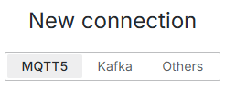
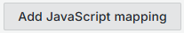
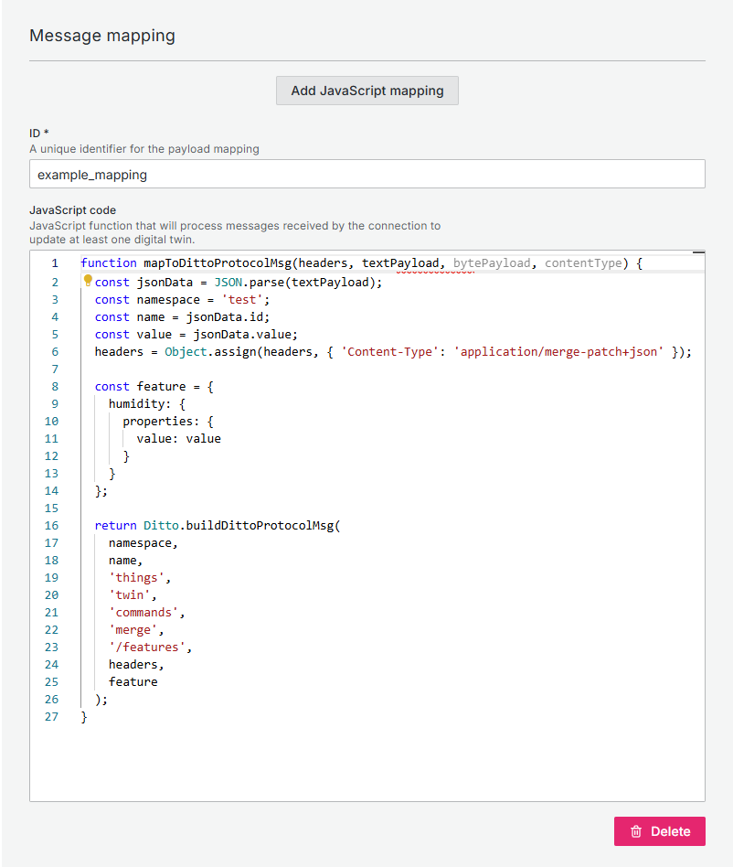
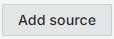
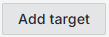
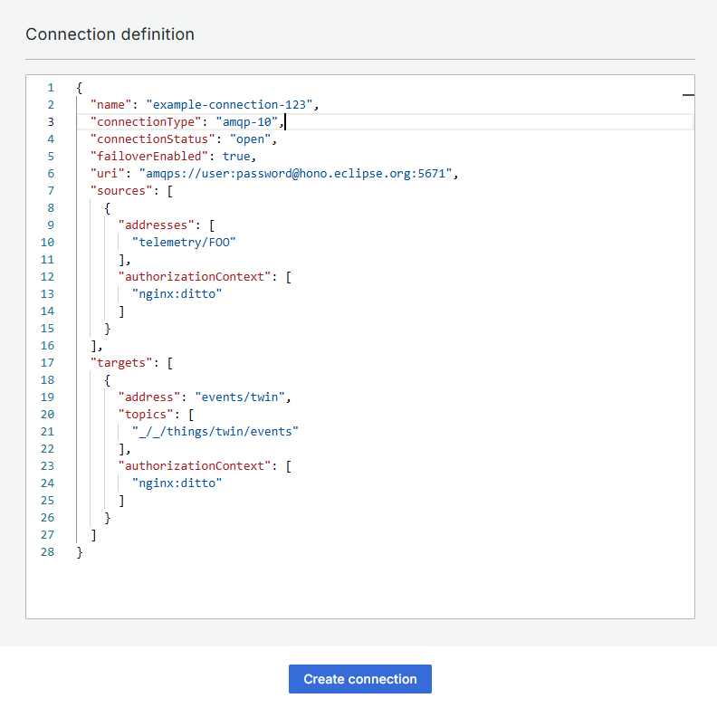

# DT connection

The way to interact with [Eclipse Ditto](https://eclipse.dev/ditto/index.html) and therefore create not only digital twins, but connections, etc. is through http requests and methods. 
Although the graphical interface of OpenTwins makes it unnecessary to go so low level, the option to communicate directly with Eclipse Ditto is still available.


:::info
For more information about Eclipse Ditto connections, please refer to the [Eclipse Ditto documentation](https://eclipse.dev/ditto/3.3/connectivity-overview.html).
:::

:::tip
Connection modification is not currently available. To modify a connection just copy its definition in the connections tab and paste the modified version in Others tab.
:::


As explained in the [Quickstart](../quickstart#connection), OpenTwins Eclipse Ditto and therefore OpenTwins need connections to receive data from the digital twins.

To create a new connection using OpenTwins plugin in Grafana, just select "Create new connection" button in "Connections" tab.


A new window with a form that will define the connection will have appeared. The first required field is the type of the connection:



import Tabs from '@theme/Tabs';
import TabItem from '@theme/TabItem';

```mdx-code-block
<Tabs className="unique-tabs"
    defaultValue="mqttkafka"
    values={[
        {label: 'MQTT or Kafka', value: 'mqttkafka'},
        {label: 'Other', value: 'other'},
    ]}>
<TabItem value="mqttkafka">
```

The form will ask information in four different sections:
## General information

This section provides general information about the connection, such as its name, description, URIs, etc:

* **ID:** This ID must be unique for each connection.
* **Status:** This indicates whether the connection is active or inactive.
:::warning
Sometimes when the message broker disconnects, the connection may become inactive even if it appears as active. In this case, just deactivate and activate the connection again to restore it.
:::
* **URI:** This is the URI of the message broker. It must be in the format protocol://host:port.


Depending if you are using MQTT or Kafka, the configuration options will vary:

```mdx-code-block
<Tabs className="unique-tabs"
    defaultValue="mqtt"
    values={[
        {label: 'MQTT', value: 'mqtt'},
        {label: 'Kafka', value: 'kafka'},
    ]}>
<TabItem value="mqtt">
```
If MQTT is selected, the only option left is **SSL**. If enabled, this will change the URI from tcp:// to ssl:// and three additional fields will appear:

* **CA certificate:** This is the path to the CA certificate file.
* **Client certificate:** This is the path to the client certificate file.
* **Client key:** This is the path to the client key file.


```mdx-code-block
</TabItem>
<TabItem value="kafka">
```
If Kafka is selected, the following fields will be available:

* **Bootstrap servers:** Contains a comma separated list of Kafka bootstrap servers to use for connecting to (in addition to the still required connection uri).
* **SASL Mechanism:** This is the SASL mechanism to use for authentication. Required if connection uri contains username/password. Choose one of the following SASL mechanisms to use for authentication at Kafka.

* **SSL:** If SSL is enabled, CA certificate field will appear.

```mdx-code-block
</TabItem>
</Tabs>
```
## Message mapping

As explained in the [Concepts](../overview/concepts#ditto-protocol), Eclipse Ditto uses a specific protocol for communication between digital twins and the physical devices they represent.
Even though this limitation, the payload mapping feature in Ditto’s connectivity APIs can be used to transform arbitrary payload consumed via the different supported protocols to Ditto Protocol messages and vice versa just through a simple JavaScript script.

First, click on  button. This will open a new form where you can define the message mapping for the connection.

Two fields should have appeared:

1. **ID:** This is a unique identifier for the mapping.
2. **JavaScript code:** This is where you can define the transformation logic using JavaScript.



The mapping function must always have the name mapToDittoProtocolMsg and the specified parameters. In addition, it must return an object or a list of objects built with Ditto.buildDittoProtocolMsg. It uses the Rhino JavaScript engine, double quotes are not allowed and semicolons are mandatory.

The code shown is an example for a mapper that updates the “humidity” feature for digital twins of the namespace "test". For example, a message { "id": "twin", "value": 5 } would update the “humidity” feature of the digital twin test:twin to 2.

This mapping function is automatically saved and can be used in the sources and targets sections below.

## Sources
Sources are the places where the messages will be read from. You can add multiple sources by clicking on the same button again.

First, click on  button. This will open a new form where you can define the sources for the connection.

Several fields are required for the target configuration:
* **Address: **This is the topic or queue where the messages will be read from.
* **Authorization context: **An authorizationContext needs to be a subject known to Ditto’s authentication. If more than one, separate them with commas.
:::warning
This feature is directly related with [Eclipse Ditto Policies](https://eclipse.dev/ditto/3.3/architecture-services-policies.html), wich are not directly configurable through OpenTwins. Be sure to configure the necessary policies in Ditto to allow the connection to work properly.
:::
* **QoS: **This option only appears if you are using MQTT and works exactly as expected in the MQTT protocol.
* **Payload mapping: **This is a drop-down menu containing the default mapping(which is none) and all your mappings created above. As explained in the [Message mapping](#message-mapping) section, this field is used to define how the message will be read from the topic.
* **Other configurations:** Add any other Eclipse Ditto settings you need in this section. This will be mixed in with the rest of the data.
:::warning
For normal usage, this section should be empty. Be sure to understand the [Eclipse Ditto connection documentation](https://eclipse.dev/ditto/3.3/connectivity-overview.html) before adding any other configuration.
:::

## Targets
Targets are the places where the messages will be sent to. First, click on  button. This will open a new form where you can define the targets for the connection. You can add multiple targets by clicking on the same button again.

Several fields are required for the target configuration:
* **Address: **This is the topic or queue where the messages will be sent.
* **Topics: **This is a list of strings for Ditto Protocol topics. Ditto Protocol topics are way Ditto uses to communicate with the outside world. For more information, please refer to the [Ditto Protocol topics](https://eclipse.dev/ditto/3.3/protocol-specification-topic.html).
* **Authorization context: **An authorizationContext needs to be a subject known to Ditto’s authentication. If more than one, separate them with commas.
:::warning
This feature is directly related with [Eclipse Ditto Policies](https://eclipse.dev/ditto/3.3/architecture-services-policies.html), wich are not directly configurable through OpenTwins. Be sure to configure the necessary policies in Ditto to allow the connection to work properly.
:::
* **QoS: **This option only appears if you are using MQTT and works exactly as expected in the MQTT protocol.
* **Payload mapping: **This is a drop-down menu containing the default mapping(which is none) and all your mappings created above. As explained in the [Message mapping](#message-mapping) section, this field is used to define how the message will be sent to the target.
* **Other configurations:** Add any other Eclipse Ditto settings you need in this section. This will be mixed in with the rest of the data.
:::warning
For normal usage, this section should be empty. Be sure to understand the [Eclipse Ditto connection documentation](https://eclipse.dev/ditto/3.3/connectivity-overview.html) before adding any other configuration.
:::


```mdx-code-block
</TabItem>
<TabItem value="other">
```
This tab is designed to create a connection using the connection schema used by Eclipse Ditto. Therefore, the user must be familiar with the [Eclipse Ditto connection documentation](https://eclipse.dev/ditto/3.3/connectivity-overview.html) to create a connection using this tab.

This method can be used to create connections of all types (MQTT, Kafka and AMQP).



Once the connection schema is defined, just click "Create connection" to establish the connection.
```mdx-code-block
</TabItem>
</Tabs>
```