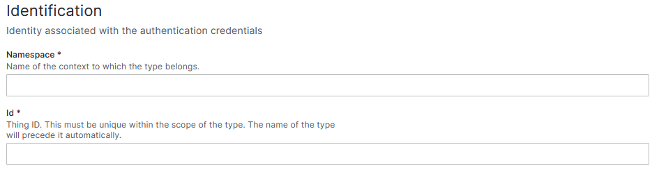

# Create a type

The way to interact with [Eclipse Ditto](https://eclipse.dev/ditto/index.html) and therefore create not only digital twins, but connections, etc. is through http requests and methods. 
Although the graphical interface of OpenTwins makes it unnecessary to go so low level, the option to communicate directly with Eclipse Ditto is still available.


import Tabs from '@theme/Tabs';
import TabItem from '@theme/TabItem';

```mdx-code-block
<Tabs className="unique-tabs"
    defaultValue="ui"
    values={[
        {label: 'Using Grafana interface', value: 'ui'},
        {label: 'Using http methods', value: 'http'},
    ]}>
<TabItem value="ui">
```
As explained in TWINS WIP, OpenTwins has two types of DT schemas. One for creating a single DT and other for creating a type to create multiple instances of a DT.


To create a new DT type using OpenTwins plugin in Grafana, just select "Create new type in" button in "Types" tab.


A new window with a form that will define the DT and a viewer of the produced JSON schema will have appeared.

The first required information is the identification of the twin. There are two required field.
- Namespace: Is the name of the context to which the type belongs.
- ID: This must be unique within the scope of the type. The name of the type will precede it automatically.



Next is type information. This basic static information about the type for description. There are several fields, but just one is required:
- Policy* : We must select a policy.
- Name.
- Description.
- Image: You can paste a image url to show in the type information.


In addition to the above information, new custom attributes can be defined, normally used as static information. By simply filling in the attribute name and its value, click on the "add" button to add a new attribute.


Finally, the features section is used to create the variables to be collected by the DT. Simply type the name and click on the "add" button. This will add a new variable to the twin schema.


An example of a schema of a DT of an abstract vehicle can be seen in the following JSON:

```JSON
{
    "thingId": "benchmark:vehicle",
    "policyId": "default:basic_policy",
    "attributes": {
        "name": "Vehicle",
        "description": "Vehicle type for generating new vehicles.",
        "image": "ImageLink",
        "Brand": "EMPTY",
        "Subtype": "EMPTY"
    },
    "features": {
        "wheels": {
            "properties": {
                "value": null
            }
        },
        "power": {
            "properties": {
                "value": null
            }
        },
        "capacity": {
            "properties": {
                "value": null
            }
        }
    }
}

```


```mdx-code-block
</TabItem>

<TabItem value="http">
```
# Creation using HTTP requests

```mdx-code-block
</TabItem>
</Tabs>

```