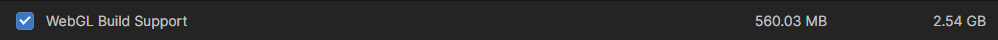

# Creation of Unity WebGL build

## Basic creation of Unity build
This guide will not show how to develop using the Unity engine, but explains what is necessary to be able to use these projects in Grafana.
For more information of how to develop with Unity you can visit the official [Unity website](https://docs.unity3d.com/Manual/index.html).

1. The first requirement is downloading the package "WebGL Build Support". In Unity Hub go to **Installs > select configuration for your desired Unity version > Add Modules** and check the following option:



2. Once having developed the visualization, an additional script must be added to your project:

 ```csharp
    using System.Collections;
    using System.Collections.Generic;
    using UnityEngine;

    public class DisableKeyboardInput : MonoBehaviour
    {
        // Start is called before the first frame update
        void Start()
        {
            #if !UNITY_EDITOR && UNITY_WEBGL
                UnityEngine.WebGLInput.captureAllKeyboardInput = false;
            #endif
        }

        // Update is called once per frame
        void Update()
        {
            
        }
    }

This script is used to prevent Unity from taking over the keyboard and mouse when interacting with it. If we don't set it, the Grafana dashboard will be unusable until we refresh the page.
Adding the script to a component that exists from the beginning of the execution (Main camera for example) should work properly.

3. Finally, to export the project, just go to **File > Build Settings ...** Select all scenes required and select WebGL platform.
Click on **Player Settings > Publishing settings > Compression Format**. Select **Disabled**. Finally click **Build**.

:::note

Feel free to modify any information you want, **Step 3** shows only the required actions to be taken in order to run Unity inside Grafana.

:::

## Additional functionalities

The Unity plugin for Grafana offers 3 main functionalities to interact with the build:
1. Send data to Unity.
2. Retrieve data from Unity.
//3. Select object to represent some information about it.

### Send data to Unity
To send data to Unity from Grafana is as simple as creating a function that collects the received data, either to work with a specific object or distribute the data to all components of the visual representation.

### Retrieve data from Unity
Data retrieving from Unity works using **events**. To send data we must create an event for each variable we want to update in Grafana.
First step is to create a **.jslib** file inside **Assets/Plugins/WebGL**, where Assets is our project Assets folder. 
It is very important that the folders have these names (if one does not exist, it is necessary to create it) because otherwise the plugin will not work.
The following script must be added into the created file:

```js

mergeInto(LibraryManager.library, {
  GetData: function (deviceId) {
    dispatchReactUnityEvent(
		"GetData", 
		Pointer_stringify(deviceId));
  }
});

```
Once created the **.jslib** file, we need to add the following code to a script in Unity inside a class but outside Start() and Update() funcions:

```csharp
#if UNITY_WEBGL && !UNITY_EDITOR
    [DllImport("__Internal")]
    private static extern void GetData(string deviceId);
#else
    private static void GetData(string deviceId){
        Debug.Log("ERROR");
    }
#endif
```
By adding it, we are enabling the execution of events just by calling GetData() function. For example the following script, sends the name of the clicked item in Unity as event to be catched by Grafana:

```csharp

using System.Collections;
using System.Collections.Generic;
using System.Runtime.InteropServices;
using UnityEngine;
using UnityEngine.UI;

public class ObjectClicker : MonoBehaviour
{
    #if UNITY_WEBGL && !UNITY_EDITOR
        [DllImport("__Internal")]
        private static extern void GetData(string deviceId);
    #else
        private static void GetData(string deviceId){
            Debug.Log("ERROR");
		}
    #endif

    // Update is called once per frame
    void Update(){
        if (Input.GetMouseButtonDown(0)){
            RaycastHit hit;
            Ray ray = Camera.main.ScreenPointToRay(Input.mousePosition);

            if (Physics.Raycast(ray, out hit, 100.0f)){
                if (hit.transform != null){
                    GameObject go = hit.transform.gameObject;
                    SendEventWithId(go);
                }
            }
        }
    }

    void SendEventWithId(GameObject go){
        if(go != null){
            Debug.Log("Nombre del objeto: " + go.name);
            GetData(go.name);
            Debug.Log("Mensaje enviado");
        }
        else{
            Debug.Log("nulo");
		}
    }
}

```