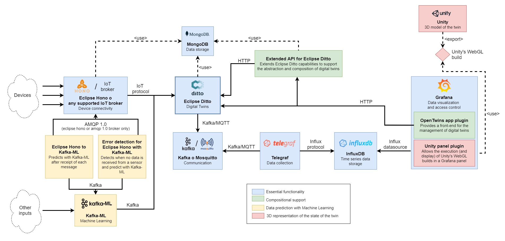

# Architecture

OpenTwins is built on a **open source microservices architecture**, designed to enhance scalability, flexibility and efficiency in the development, extension, deployment and maintenance of the platform. All the components that make up this architecture are encapsulated in [Docker](https://www.docker.com/) containers, ideally managed through [Kubernetes](https://kubernetes.io/), which ensures efficient portability and management. 

:::note

Although it is possible to deploy and connect the different components without containerization, this approach is not recommended due to the difficulties involved in terms of installation and management. However, it is important to note that OpenTwins could be [manually connected](../installation/manual.md) to non-containerized components, such as a local instance of Grafana.

:::

The following image illustrates the current architecture of OpenTwins, in which each color of the boxes represents the functionality covered by each component. Most of these components are external projects to our organization, however, we also include certain services specifically designed to enrich the functionality of the platform. Both the code and documentation of the [components](https://github.com/ertis-research/opentwins/tree/main/components) are available in their respective repositories.

### Essential functionality

The elements highlighted in **blue** form the heart of OpenTwins, as they provide the **essential functionalities** of a digital twin development platform: the definition of digital twins, the connection to IoT devices, the storage of information and the user-friendly visualisation of data. The tools used in this case include:
  - [Eclipse Ditto](https://www.eclipse.org/ditto/). This is **the core component of OpenTwins**, an open-source framework for digital twins developed by the [Eclipse Foundation](https://www.eclipse.org/). Eclipse Ditto provides an abstract entity ["Thing"](https://eclipse.dev/ditto/basic-thing.html), which allows describing digital twins through JSON schemas that include both static and dynamic data of the entity. The framework stores the current state of the "Thing" entity and facilitates its [connection](https://eclipse.dev/ditto/basic-connections.html) to input and output data sources through various IoT protocols. In a typical scenario, the Thing entity will update its information via a source connection, generating events that are sent to the indicated target connections. In addition, the tool provides an [API](https://eclipse.dev/ditto/http-api-doc.html) that allows querying the current state of the entity and managing its schema and connections.
  - [Eclipse Hono](https://www.eclipse.org/hono/). This component facilitates the **reception of data through various IoT protocols** and centralizes it into a single endpoint, either [AMQP 1.0](https://www.amqp.org/) or [Kafka](https://kafka.apache.org/). This output connects directly to Eclipse Ditto, eliminating the need for users to manually connect to an external broker to extract data. This allows the platform to receive data through the most common IoT protocols, giving devices the flexibility to connect to the most appropriate protocol for their particular case.  

  :::warning

  Despite its advantages, we have observed that **Eclipse Hono does not scale correctly when the message frequency is high**, so we do not recommend its use in these cases. For this reason, or if it is not necessary to offer different input protocols, you can choose to connect Eclipse Ditto to one or more specific messaging brokers, such as [Mosquitto](https://mosquitto.org/) or [RabbitMQ](https://www.rabbitmq.com/).

  :::
  - [MongoDB](https://www.mongodb.com/). This tool is the **internal database used by Eclipse Hono and Eclipse Ditto**. Eclipse Ditto stores data about the current state of digital twins ("things"), policies, connections and recent events, while Eclipse Hono stores information about defined devices and groups.
  
  - [InfluxDB v2](https://www.influxdata.com/products/influxdb-overview/). This database provides an optimized architecture for time series, which guarantees superior performance in **storing and querying digital twin data**. Its high scalability and simplicity of use allow it to efficiently handle large volumes of data, facilitating the integration and analysis of information in real time. In addition, it is one of the most popular options in the field of the Internet of Things (IoT), generating an active community that consolidates its position as a robust solution.

  - [Telegraf](https://www.influxdata.com/time-series-platform/telegraf/). This server-based agent for **collecting and sending metrics** offers easy configuration and a wide range of plugins to integrate various data sources and destinations. It is the recommended choice for data ingestion into InfluxDB. Its role in the platform is to capture digital twin updates, presented as Eclipse Ditto events, processing the data as time series for storage in the database.

  - [Apache Kafka](https://kafka.apache.org/) or [Eclipse Mosquitto](https://mosquitto.org/). An **intermediary messaging broker** is required for Telegraf to collect event data from Eclipse Ditto, since none of these technologies provide this role and do not have a direct connection. For this purpose, any messaging broker where Eclipse Ditto can publish and read Telegraf is valid. The options available on the platform include Apache Kafka, known for its scalability and error tolerance in processing large volumes of data, and Mosquitto, recognized for its efficiency in messaging and its flexibility in IoT environments.

  - [Grafana](https://grafana.com/oss/grafana/). This solution acts as the **platform's main front-end**, providing a highly adaptable data visualization that allows users to create intuitive and easily understandable dashboards. Its ability to integrate with a wide variety of data sources and its active community of users and developers make it a powerful tool for monitoring and analyzing complex systems, such as digital twins. In addition, it allows users to expand its functionality by creating custom plugins, giving them the ability to integrate new visualizations, use-case specific panels and connectors to additional data sources. 

### Compositional support 

The [composition of digital twins](./concepts.md#digital-twins-composition) represents one of the main contributions of this platform, distinguishing it from other similar solutions. In addition, OpenTwins provides the ability to define and compose ["types" of digital twins](./concepts.md#digital-twin-type), making development simpler. The services marked in **green** in the architecture are responsible for integrating these functionalities.

  - [Extended API for Eclipse Ditto](https://github.com/ertis-research/extended-api-for-eclipse-ditto/). The Thing entity provided by Eclipse Ditto must follow a specific JSON schema, although it offers great flexibility within it. Our goal is to simplify type definition and entity composition by taking advantage of the flexibility of this schema. This "extended API" acts as a **layer on top of the Eclipse Ditto API**, distinguishing between the management of twins and types, and applying all the necessary constraints and checks to ensure the composition of these entities according to the constraints imposed by each (types form graphs, while twins form trees).

  - [OpenTwins app plugin for Grafana](https://github.com/ertis-research/opentwins-in-grafana/). To have a pleasant and usable platform for as many users as possible, it is important to have a simple **interface** capable of performing the functionalities available. Therefore, an app plugin is included for Grafana that uses the extended API to query and manage twins, types and their composition in a user-friendly way. Moreover, this approach keeps the entire platform front-end within a single tool, making it easy to use and accessible.

### Data prediction with machine learning

The architecture highlights in **yellow** the components that facilitate the integration of digital twins with Machine Learning models. Providing this support represents a crucial aspect in the development of a digital twin, since it provides a complementary or comparative perspective with real data, enriching the understanding of the replicated object. To achieve this goal, the following tools are used:

  - [Kafka-ML](https://github.com/ertis-research/kafka-ml). This open source framework manages the lifecycle of ML/AI applications in production environments through continuous data streams. Unlike traditional frameworks that work with static data sets, Kafka-ML enables both training and inference with continuous data streams, allowing users to have fine-grained control over ingestion data. Currently, Kafka-ML is compatible with the most popular ML frameworks, [TensorFlow](https://www.tensorflow.org/) and [PyTorch](https://pytorch.org/), and enables the **management and deployment of ML models**, from definition to final deployment for inference. This component operates as a black box in OpenTwins, receiving input data for a deployed model through a Kafka topic and sending the predicted result to another topic, which is connected to Eclipse Ditto in a way that updates to the corresponding digital twin.

  - [Eclipse Hono to Kafka-ML](https://github.com/ertis-research/eclipse-hono-to-kafka-ml). Kafka-ML can receive input data from any source that is able to publish to a Kafka topic. However, at OpenTwins we have decided to simplify this process when the data comes from Eclipse Hono. Therefore, we have developed an optional service that automates the data feed of ML models deployed in Kafka-ML. This service **automatically sends the data needed to make a prediction** every time a new data is received from any of the devices required by the model. To use this tool, we provide an API that allows you to specify which devices should be taken into account, what data is required from these devices and how they should be formatted to work correctly as input for Kafka-ML.

  - [Error detection for Eclipse Hono with Kafka-ML](https://github.com/ertis-research/error-detection-for-eclipse-hono-with-kafka-ml). An ML model useful in the construction of a digital twin is one capable of generating data that a sensor should produce in case it loses connection or experiences a failure. To automate this, we have developed an optional service with similar functionalities to the one mentioned above, but with an important particularity: it will only invoke the model when an interruption in data reception by the device is detected. This service takes into account the frequency with which the data is emitted by the device. As soon as an anomaly is identified, the service will format and send the last data received following the expected frequency until the connection is restored and real data is received again. In this way, the **normal operation of the device is simulated**, ensuring continuity of information for the digital twin.

### 3D representation

:::note

Although Unity is not open source, at the moment it is the only graphics engine we have tested the plugin with. 
However, it could be replaced by any other graphics engine that compiles in WebGL, such as [Godot](https://godotengine.org/), since the plugin is expected to be able to render any WebGL compilation. However, since we have not yet tested with other graphics engines, we cannot guarantee this.

:::

Although it may seem a secondary aspect, the representation of the digital twin makes a major difference in its utility and adoption. An intuitive and attractive visual interface for users will facilitate the understanding and accessibility of the data received, which simplifies the optimization of the actual system. 3D representations stand out as one of the most effective options in this sense, which motivates most private digital twin platforms to offer support for them. For this reason, OpenTwins allows adding an interactive 3D representation of the digital twin that reacts dynamically to data received from any source (real, predicted or simulated). The components highlighted in **red** are the ones that enable this functionality.

  - [Unity](https://unity.com/) This powerful **graphics engine**, versatile in both 3D and 2D development, is widely used in the creation of video games, simulations and engineering. It is recognized as one of the most popular, supported by a large and active community. Although it is not open source software, it can be used [free of charge for personal or low-profit projects](https://unity.com/es/products/unity-personal?currency=EUR). The technology of this engine allows to assign behaviors to 3D objects by means of scripts, which facilitates interaction both with the user and with other elements of the environment.

  :::info
  Unity offers a wide range of [formats for importing 3D models](https://docs.unity3d.com/2023.2/Documentation/Manual/3D-formats.html), but we emphasize its integration with [Blender](https://www.blender.org/), an open source 3D creation suite that is equally popular and supported by an active community. 
  :::

  On the other hand, Unity provides the possibility to compile projects in the **Unity [WebGL](https://get.webgl.org/)** format, perfect for web rendering. This option is the choice of OpenTwins, as it allows easy integration with existing web technologies, ensuring accessibility and distribution without the need for additional installations.

  - [Unity panel plugin for Grafana](https://github.com/ertis-research/unity-plugin-for-grafana). Since Grafana serves as the front-end of OpenTwins, it is convenient that the 3D representations are embedded directly into this tool, providing a unified management and visualization of the digital twin. To achieve this, a plugin capable of **rendering WebGL compilations within a Grafana panel** has been developed. This plugin is able to send the digital twin data from Grafana to the compilation, allowing it to influence the rendering in real time. In addition, this plugin enables direct user interaction with the 3D model, allowing actions on 3D elements to affect other panels of the dashboard. For example, by clicking on a 3D element, another Grafana panel can automatically display data related to it.

